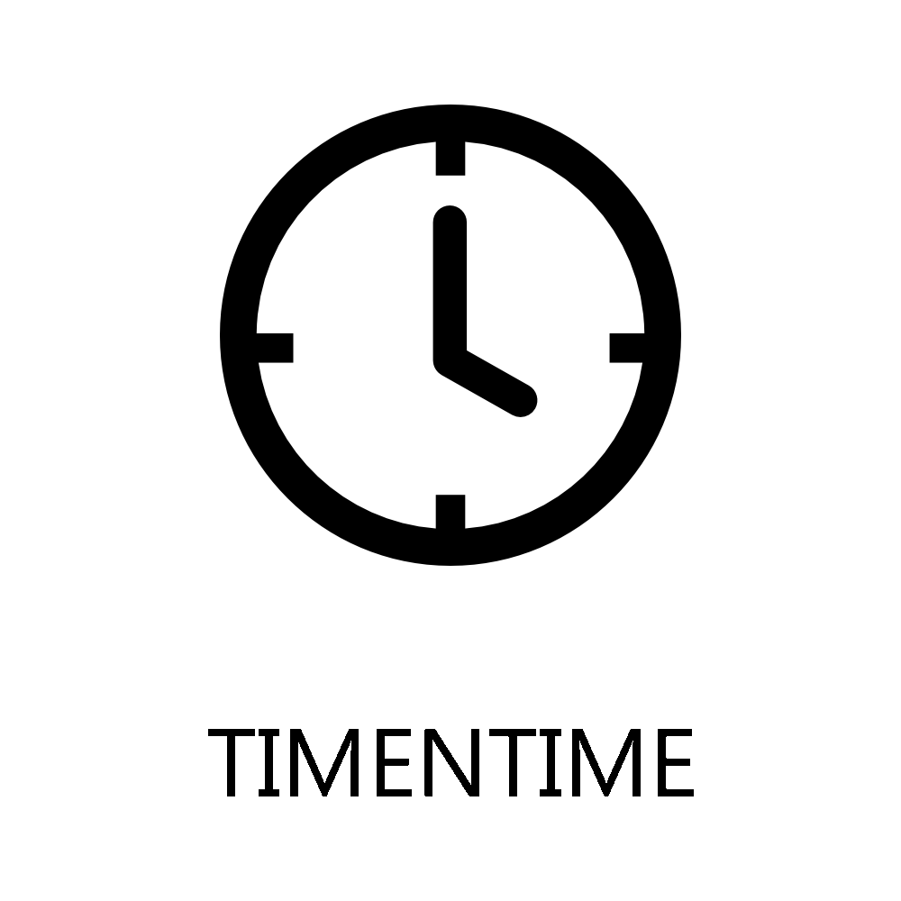
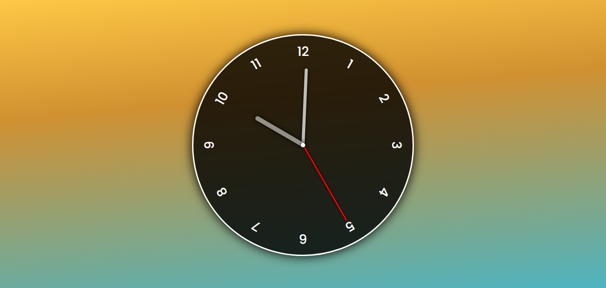
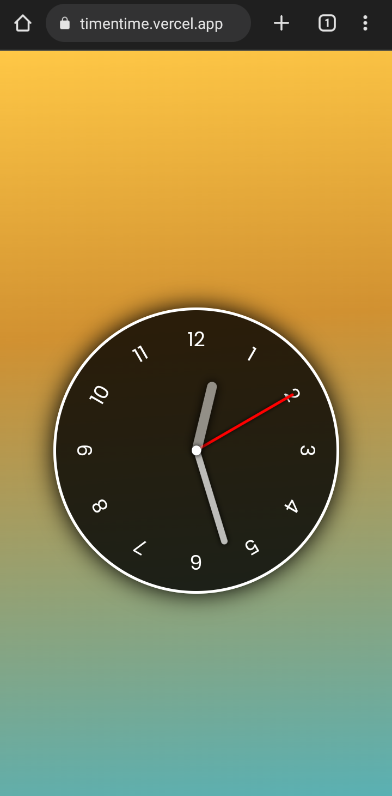

<h1 align="center"><h1>
<h1 align="center">TIMENTIME</h1>

<a href="https://timentime.vercel.app">Clique para visualizar o projeto.</a>

<h1>Sumário:</h1>

* [Sobre](#about)
* [Funcionalidades](#functionalities)
* [Tecnologias](#technologies)
* [Dispositivos](#devices)
    * [Desktop](#desktop)
    * [Mobile](#mobile)
* [Licença](#license)
* [Autor](#author)

<h1 id="about">Sobre</h1>

<a href="https://timentime.vercel.app">TIMENTIME</a> (Horário) é o projeto de um relógio analógico. Desenhado inteiramente com CSS puro e funcionalidade atribuída com Javascript

<h1 id="functionalities">Funcionalidades</h1>

A funcionalidade geral do projeto é mostrar que horas são de uma forma minimalista. Contudo, os ponteiros do relógio se movem de acordo com o horário online do fuso em que se encontra o usuário.

<h1 id="technologies">Tecnologias</h1>

As tecnologias utilizadas durante o desenvolvimento foram:
<ul>
<li><a href="https://html.com/" title="HTML">HTML (Hyper Text Markup Language)</a></li>
<li><a href="https://developer.mozilla.org/pt-BR/docs/Web/CSS/" title="CSS">CSS (Cascading Style Sheet)</a></li>
<li><a href="https://www.javascript.com/" title="Javascript">JS (Javascript)</a></li>
</ul>

<h1 id="devices">Dispositivos</h1>

Além de funcional o TIMENTIME também é responsivo, possuindo layouts para <a href="#desktop" title="desktop">computadores</a> e <a href="#mobile" title="mobile">dispositivos móveis</a>.

<h1 id="desktop">Desktop</h1>

A aplicação foi desenvolvida primeiramente para dispositivos grandes, como computadores ou laptops. Veja abaixo a experiência em Desktop:

<h1 align="center"><h1>

<h1 id="mobile">Mobile</h1>

Mas é claro que não poderia faltar a responsividade para dispositivos móveis, como smartphones e tablets. Veja abaixo a experiência em Mobile:

<h1 align="center"><h1>

<h1 id="license">Licença ⚖️</h1>

A licença utilizada no projeto foi a <a href="https://mit-license.org/">MIT LICENSE</a>.

<h1 id="author">Autor</h1>

Projeto desenvolvido por <a href="https://github.com/EduDevCode" title="Eduardo M. dos S. Delfino">Eduardo M. dos S. Delfino</a>.

